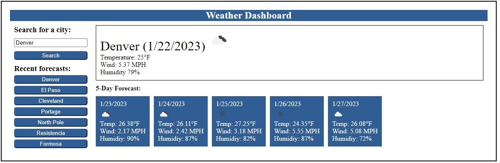

# Weekly Challenge 06 Create a weather dashboard.

## URL to Application

https://greg4949.github.io/weather-dashboard/

## Description

The purpose of this project was to create a weather dashboard app that provide current weather and 5 day weather forecast. 

## Installation

N/A

## Usage

The weather dashboard application can be accessed at the URL listed at the top of the README.  A user can enter a city for which they want the weather and click search.  Current weather conditions along with a 5 day forecast will display and the city for which the weather was searched will be saved in recent forecasts.  A user can retrieve the forecast for the recent city by clicking on the button with that city's name.

## Credits

N/A

## License

Please refer to the LICENSE in the repo.
